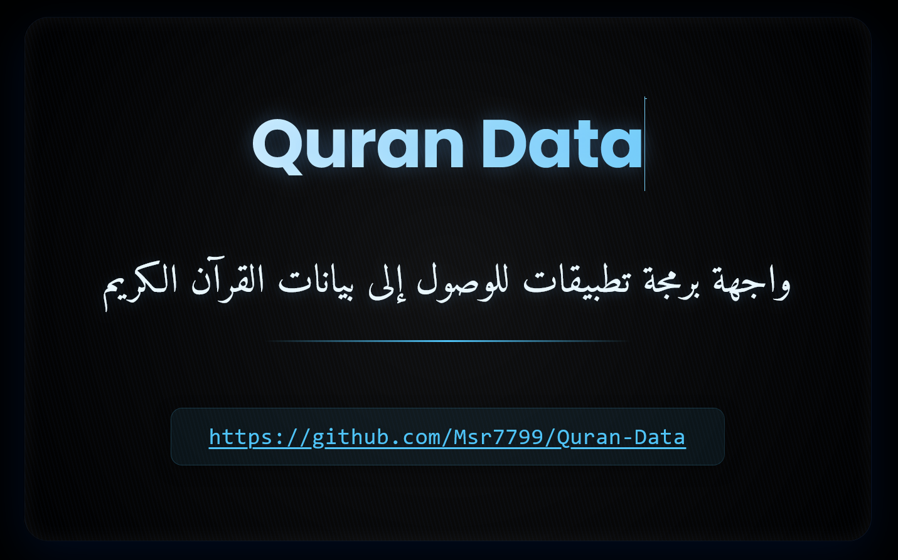

# Quran Data

## مقدمة

مشروع `quran_data` يوفر بيانات شاملة عن القرآن الكريم، بما في ذلك السور، الآيات، والصوتيات. يوفر المشروع قواعد البيانات بصيغ متعددة مثل JSON وCSV وSQLite، ويشمل أيضًا واجهة برمجة تطبيقات (API) لعرض هذه المعلومات وتسهيل الوصول إليها.



## هيكل المشروع

```
📂 quran_data
│
├── 📂 server
│   ├── 📂 controllers
│   │   └── surahController.mjs          # مسؤول عن معالجة الطلبات المتعلقة بالسور والآيات.
│   ├── 📂 middleware
│   │   └── rateLimiter.mjs              # إدارة الحد من عدد الطلبات لتحسين الأداء والأمان.
│   ├── 📂 routes
│   │   └── apiRoutes.mjs                # تعريف المسارات الخاصة بواجهة برمجة التطبيقات (API).
│   ├── 📂 utils
│   │   ├── errorHandler.mjs             # معالجة الأخطاء في تطبيق الويب.
│   │   ├── errorUtils.mjs               # أدوات مساعدة لمعالجة الأخطاء.
│   │   └── notFoundHandler.mjs          # معالجة المسارات غير المعروفة.
│   ├── config.mjs                       # إعدادات التكوين الخاصة بالتطبيق.
│   └── server.js                        # نقطة الدخول للتطبيق وتشغيل الخادم.
│
├── 📂 data
│   ├── mainDataQuran.json                # البيانات الرئيسية المتعلقة بالقرآن الكريم.
│   ├── pagesQuran.json                # بيانات صفحات القرآن الكريم
│   ├── 📂 json
│   │   ├── metadata.json                # بيانات تعريفية حول السور.
│   │   ├── 📂 surah
│   │   │   └── surah_1.json             # بيانات السور بشكل مفصل.
│   │   ├── 📂 verses
│   │   │   └── 001_001.json             # بيانات الآيات لكل سورة.
│   │   ├── 📂 audio
│   │   │   └── audio_surah_1.json       # بيانات الصوتيات لكل سورة.
│   │   └── ...
│   ├── 📂 sqlite
│   │   ├── database.sqlite              # قاعدة البيانات بصيغة SQLite.
│   └── 📂 csv
│       └── database.csv                 # قاعدة البيانات بصيغة CSV.
├── 📂 scripts
│   ├── jsonToCsv.mjs                    # سكربت لتحويل بيانات JSON إلى CSV.
│   ├── jsonToSqlite.mjs                 # سكربت لتحويل بيانات JSON إلى SQLite.
│   └── splitData.mjs                   # سكربت لتقسيم البيانات الكبيرة إلى ملفات أصغر.
│
├── 📂 docs
│   └── api_documentation.md             # توثيق واجهة برمجة التطبيقات (API).
│
└── 📄 README.md
```

## كيفية التشغيل

1. **تثبيت التبعيات:**

   تأكد من أنك في المجلد الرئيسي للمشروع ثم قم بتثبيت التبعيات باستخدام npm:

   ```bash
   npm install
   ```

2. **تشغيل الخادم:**

   لتشغيل الخادم، استخدم الأمر التالي:

   ```bash
   npm start
   ```

   سيتم تشغيل الخادم على المنفذ المحدد في ملف `config.mjs`.

3. **تشغيل السكربتات:**

   لتحويل بيانات JSON إلى CSV أو SQLite، استخدم السكربتات الموجودة في مجلد `scripts`. على سبيل المثال:

   ```bash
   node scripts/jsonToCsv.mjs
   ```

   ```bash
   node scripts/jsonToSqlite.mjs
   ```

## تفاصيل البيانات

### mainDataQuran.json

يحتوي على بيانات مفصلة عن السور والآيات بما في ذلك النصوص، عدد الآيات، عدد الكلمات، عدد الحروف، الصوتيات، والمزيد. الهيكل العام للبيانات هو كما يلي:

```json
[
  {
    "number": 0, // رقم السورة
    "name": {
      "ar": "", // الاسم بالعربية
      "en": "", // الاسم بالإنجليزية
      "transliteration": "" // الاسم بالنقل الصوتي
    },
    "revelation_place": {
      "ar": "", // مكان النزول بالعربية
      "en": "" // مكان النزول بالإنجليزية
    },
    "verses_count": 0, // عدد الآيات في السورة
    "words_count": 0, // عدد الكلمات في السورة
    "letters_count": 0, // عدد الحروف في السورة
    "verses": [
      {
        "number": 0, // رقم الآية في السورة
        "text": {
          "ar": "", // النص بالعربية
          "en": "" // النص بالإنجليزية
        },
        "juz": 0, // الجزء الذي تنتمي إليه الآية
        "page": 0, // رقم الصفحة التي تظهر فيها الآية
        "sajda": false // معلومات حول السجدة
      }
    ],
    "audio": [
      {
        "id": 0, // معرف التسجيل الصوتي
        "reciter": {
          "ar": "", // اسم القارئ بالعربية
          "en": "" // اسم القارئ بالإنجليزية
        },
        "rewaya": {
          "ar": "", // الرواية بالعربية
          "en": "" // الرواية بالإنجليزية
        },
        "server": "", // اسم الخادم
        "link": "" // رابط التسجيل الصوتي
      }
    ]
  }
]
```

## كيفية استخدام واجهة برمجة التطبيقات (API)

لمزيد من المعلومات حول كيفية استخدام واجهة برمجة التطبيقات، [راجع الصفحة](https://quran.i8x.net/docs).

- **الخادم المحلي**: `http://localhost:5000/api`

## 🚀 النقاط النهائية (Endpoints)

### 1. 🕌 استرجاع جميع السور

- **النقطة**: `/surahs`
- **الطريقة**: `GET`
- **الوصف**: استرجاع قائمة بجميع السور في القرآن.

#### 📦 مثال `curl`:

```bash
curl -X GET "http://localhost:5000/api/surahs"
```

#### ✅ الاستجابة:

```json
{
  "success": true,
  "result": [
    {
      "number": 1,
      "name": {
        "ar": "الفاتحة",
        "en": "The Opening",
        "transliteration": "Al-Fatihah"
      },
      "revelation_place": {
        "ar": "مكية",
        "en": "Meccan"
      },
      "verses_count": 7,
      "words_count": 29,
      "letters_count": 139
    }
  ]
}
```

---

### 2. 📖 استرجاع سورة محددة

- **النقطة**: `/surah`
- **الطريقة**: `GET`
- **الوصف**: استرجاع سورة معينة باستخدام معرف (ID) السورة.

#### 📝 المعلمة:

- `surah_id` (إجباري) - معرف السورة.

#### 📦 مثال `curl`:

```bash
curl -X GET "http://localhost:5000/api/surah?surah_id=1"
or
curl -X GET "http://localhost:5000/api/surah/1"
```

#### ✅ الاستجابة:

```json
{
  "success": true,
  "result": {
    "number": 1,
    "name": {
      "ar": "الفاتحة",
      "en": "The Opening",
      "transliteration": "Al-Fatihah"
    },
    "verses_count": 7,
    "audio": [
      {
        "id": 1,
        "reciter": {
          "ar": "أحمد الحواشي",
          "en": "Ahmed Al-Hawashi"
        },
        "link": "https://server11.mp3quran.net/hawashi/001.mp3"
      }
    ]
  }
}
```

---

### 3. 📜 استرجاع جميع الآيات لسورة محددة

- **النقطة**: `/verses`
- **الطريقة**: `GET`
- **الوصف**: استرجاع جميع الآيات الخاصة بسورة معينة.

#### 📝 المعلمة:

- `surah_id` (إجباري) - معرف السورة.

#### 📦 مثال `curl`:

```bash
curl -X GET "http://localhost:5000/api/verses?surah_id=1"
or
curl -X GET "http://localhost:5000/api/verses/1"
```

#### ✅ الاستجابة:

```json
{
  "success": true,
  "result": [
    {
      "number": 1,
      "text": {
        "ar": "الٓمٓ",
        "en": "Alif, Lam, Meem"
      },
      "juz": 1,
      "page": 2
    }
  ]
}
```

---

### 4. 🕋 استرجاع جميع الآيات التي تحتوي على سجدة

- **النقطة**: `/sajda`
- **الطريقة**: `GET`
- **الوصف**: استرجاع قائمة بالآيات التي تحتوي على مواضع سجدة.

#### 📦 مثال `curl`:

```bash
curl -X GET "http://localhost:5000/api/sajda"
```

#### ✅ الاستجابة:

```json
{
  "success": true,
  "result": [
    {
      "number": 15,
      "text": {
        "ar": "وَلِلَّهِۤ يَسۡجُدُۤ...",
        "en": "And to Allah prostrates..."
      },
      "sajda": {
        "id": 2,
        "recommended": true
      }
    }
  ]
}
```

---

### 5. 🎧 استرجاع التسجيل الصوتي لسورة محددة

- **النقطة**: `/audio`
- **الطريقة**: `GET`
- **الوصف**: استرجاع التسجيل الصوتي لسورة معينة.

#### 📝 المعلمة:

- `surah_id` (إجباري) - معرف السورة.

#### 📦 مثال `curl`:

```bash
curl -X GET "http://localhost:5000/api/audio?surah_id=1"
or
curl -X GET "http://localhost:5000/api/audio/1"
```

#### ✅ الاستجابة:

```json
{
  "success": true,
  "result": [
    {
      "id": 1,
      "reciter": {
        "ar": "أحمد الحواشي",
        "en": "Ahmed Al-Hawashi"
      },
      "link": "https://server11.mp3quran.net/hawashi/001.mp3"
    }
  ]
}
```

---

### 6. 📄 استرجاع معلومات الصفحة بناءً على السورة أو الآية

- **النقطة**: `/pages`
- **الطريقة**: `GET`
- **الوصف**: استرجاع معلومات الصفحات التي تحتوي على سورة معينة أو آية محددة. يمكن تحديد السورة فقط، أو السورة والآية معًا للحصول على الصفحة الدقيقة.

#### 📝 المعلمات:

- `surah_id` معرف السورة.
- `verse_id` معرف الآية.
- `page` رقم الصفحة.

#### 📦 مثال `curl`:

**استرجاع الصفحات بناءً على معرف السورة:**

```bash
curl -X GET "http://localhost:5000/api/pages/2"
or
curl -X GET "http://localhost:5000/api/pages?surah_id=2"
```

**استرجاع الصفحة بناءً على السورة والآية:**

```bash
curl -X GET "http://localhost:5000/api/pages?surah_id=2&verse_id=15"
or
curl -X GET "http://localhost:5000/api/pages/2/15"
```

**استرجاع الصفحة بناءً على رقم الصفحة:**

```bash
curl -X GET "http://localhost:5000/api/pages?page=604"
```

#### ✅ الاستجابة:

```json
{
  "success": true,
  "result": {
    "page": 5,
    "image": {
      "url": "/data/quran_image/5.png"
    },
    "start": {
      "surah_number": 2,
      "verse": 25,
      "name": {
        "ar": "البقرة",
        "en": "The Cow",
        "transliteration": "Al-Baqarah"
      }
    },
    "end": {
      "surah_number": 2,
      "verse": 29,
      "name": {
        "ar": "البقرة",
        "en": "The Cow",
        "transliteration": "Al-Baqarah"
      }
    }
  }
}
```

## دعم Docker

يوفر `quran_data` دعمًا لتشغيله داخل حاوية Docker. اتبع الخطوات أدناه لبناء الصورة وتشغيل الحاوية.

### بناء الصورة

1. **تأكد من تثبيت Docker:**

   تأكد من أنك قد قمت بتثبيت Docker على جهازك. يمكنك تنزيله وتثبيته من [موقع Docker الرسمي](https://www.docker.com/get-started).

2. **بناء صورة Docker:**

   انتقل إلى جذر مشروعك ثم استخدم الأمر التالي لبناء الصورة:

   ```bash
   docker build -t quran_data .
   ```

### تشغيل الحاوية

1. **تشغيل حاوية Docker:**

   بعد بناء الصورة، يمكنك تشغيل الحاوية باستخدام الأمر التالي:

   ```bash
   docker run -d -p 3000:5000 -e PORT=5000 -e API_RATE_LIMIT=300 --name quran_data_container quran_data
   ```

   - `-d`: تشغيل الحاوية في الخلفية.
   - `-p 3000:5000`: تعيين المنفذ 5000 في الحاوية إلى المنفذ 3000 على جهازك.
   - `--name quran_data_container`: تعيين اسم للحاوية.

2. **الوصول إلى التطبيق:**

   يمكنك الوصول إلى التطبيق عبر متصفح الويب باستخدام العنوان التالي:

   ```
   http://localhost:5000
   ```

### إيقاف الحاوية

لإيقاف الحاوية، استخدم الأمر التالي:

```bash
docker stop quran_data_container
```

### حذف الحاوية والصورة

إذا كنت ترغب في حذف الحاوية والصورة، استخدم الأوامر التالية:

```bash
docker rm quran_data_container
docker rmi quran_data
```

## المساهمة

إذا كنت ترغب في المساهمة في هذا المشروع، يرجى فتح طلبات سحب (Pull Requests) عبر GitHub وتقديم اقتراحاتك أو التعديلات التي ترغب في إضافتها.

## الترخيص

يتم ترخيص هذا المشروع تحت [رخصة MIT](./LICENSE).

- مثال على الواجهة [quran-data](https://quran.i8x.net/)

## تحميل القاعدة

<div align="center">


[](https://github.com/rn0x/Quran-Json/releases/download/database/database.json)

[](https://github.com/rn0x/Quran-Json/releases/download/database/database.sqlite)

[](https://github.com/rn0x/Quran-Json/releases/download/database/database.csv)

</div>

<p align="center">
للهم أجعل هذا العمل صدقه جاريه لي ولوالدي ولأهل بيتي ولكل مسلم ساهم او دعم او نشر هذه المشروع 🤲🏻
</p>
